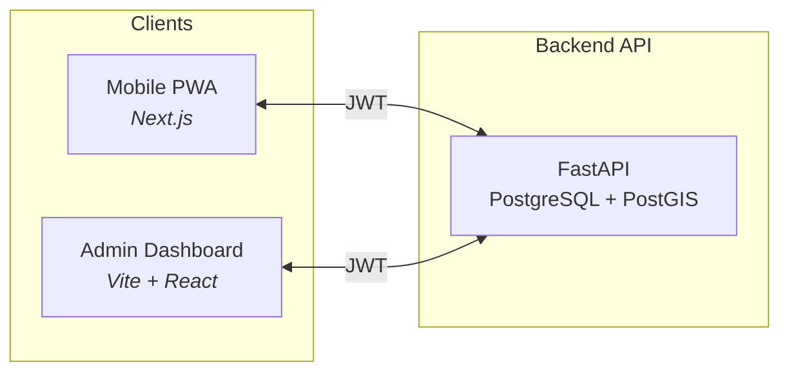

# Hausheld

> Home-help workflow platform for NRW — scheduling, GPS-verified check-in/out, digital signatures, and Entlastungsbetrag tracking. Built with data integrity and EU/GDPR in mind.

---

## Table of contents

- [Features](#features)
- [Architecture](#architecture)
- [Tech stack](#tech-stack)
- [Geospatial & substitution](#geospatial--substitution)
- [GDPR & compliance](#gdpr--compliance)
- [Shift workflow](#shift-workflow)
- [Quick start](#quick-start)
- [Demo mode](#demo-mode)
- [API reference](#api-reference)

---

## Features

| Area | Description |
|------|-------------|
| **Mobile PWA** | Workers see their schedule, check in/out with GPS, capture client signatures (Leistungsnachweis). |
| **Admin dashboard** | Calendar, sick leave, substitute suggestions, client budget alerts, SGB XI CSV export, audit log. |
| **Substitution engine** | Suggests up to 3 replacement workers by distance (PostGIS) and weekly capacity. |
| **Budget & billing** | Per-client monthly budget, 15% alert threshold, CSV export for insurance (SGB XI). |
| **Audit trail** | Append-only log of every access to client (health) data; read-only API. |

---

## Architecture

Hausheld is a distributed ecosystem: one API, two frontends. All mutations go through the backend with JWT and role-based access (Admin vs Worker).



- **Backend** (`/backend`) — Single source of truth. FastAPI, SQLAlchemy 2 (async), PostgreSQL + PostGIS, Alembic. Enforces RBAC, encrypts health data, writes to the audit log.
- **Mobile** (`/frontend`) — Next.js PWA (German UI). Schedule, check-in/out, signature pad, client list for assigned shifts.
- **Admin** (`/admin`) — Vite + React. Calendar (FullCalendar), workers & sick leave, clients & budget alerts, billing export, audit log, substitute assignment.

Data flow is unidirectional: frontends only call the API; no direct DB access from the client.

---

## Tech stack

| Path | Stack | Role |
|------|--------|------|
| `/backend` | FastAPI, PostgreSQL, PostGIS, SQLAlchemy 2, Alembic, Pydantic | API, auth, substitutions, budget, audit, SGB XI export |
| `/frontend` | Next.js, Tailwind, PWA | Mobile worker app |
| `/admin` | Vite, React, Tailwind, FullCalendar | Desktop admin |

---

## Geospatial & substitution

PostgreSQL/PostGIS powers **distance-based substitute suggestions** when a shift is unassigned (e.g. worker on sick leave).

- **Worker** and **Client** models store a PostGIS point (WGS84): `current_location` and `address_location`.
- **Endpoint:** `GET /shifts/{id}/suggest-substitutes` (Admin only).
- **Logic:** Ranks candidates by `ST_Distance` (client ↔ worker), excludes overlapping shifts and workers over their weekly `contract_hours`.
- **Result:** Up to 3 workers with distance (m) and remaining capacity; admin assigns with one click.

---

## GDPR & compliance

| Measure | Implementation |
|--------|-----------------|
| **Health data encryption** | Fernet (AES) for `insurance_number` and `care_level`; key via `ENCRYPTION_KEY` (not in DB). |
| **Audit log** | Append-only `audit_logs`: user, action, target, timestamp. Read-only API — no tampering. |
| **Soft deletes** | Workers, clients, shifts: only `deleted_at` set; rows kept for audit/legal hold. |
| **Data residency** | Designed for AWS eu-central-1 (Frankfurt); health data stays in Germany. |

Full statement: [GDPR_COMPLIANCE.md](./GDPR_COMPLIANCE.md).

---

## Shift workflow

Shifts follow a strict state machine; GPS and signatures provide verifiable proof of service.

| Status | Meaning |
|--------|---------|
| **Scheduled** | Worker assigned; not started. |
| **In_Progress** | Worker has checked in (GPS + timestamp stored). |
| **Completed** | Worker has checked out (GPS + client signature); cost set for budget deduction. |
| **Unassigned** | No worker (e.g. sick leave); admin can use suggest-substitutes and assign. |
| **Cancelled** | Shift not carried out. |

Transitions: `Scheduled` → (check-in) → `In_Progress` → (check-out + signature) → `Completed`. GPS-verified check-in/out replaces paper forms for insurers and audits.

---

## Quick start

**1. Database (PostgreSQL + PostGIS)**

```bash
createdb hausheld
psql -d hausheld -c "CREATE EXTENSION IF NOT EXISTS postgis;"
```

**2. Backend**

```bash
cd backend
python -m venv .venv
# .venv\Scripts\activate  (Windows) or source .venv/bin/activate (Linux/macOS)
pip install -r requirements.txt
cp .env.example .env
# Edit .env: DATABASE_URL, JWT_SECRET, AUTH_DEV_MODE=true
alembic upgrade head
python -m app.utils.seed_demo   # optional: demo data
uvicorn app.main:app --reload
```

→ API: http://127.0.0.1:8000 · Docs: http://127.0.0.1:8000/docs

**3. Mobile frontend**

```bash
cd frontend
npm install
cp .env.example .env.local   # NEXT_PUBLIC_API_URL=http://localhost:8000
npm run dev
```

→ http://localhost:3000 — use Demo Login, then open schedule.

**4. Admin dashboard**

```bash
cd admin
npm install
# .env: VITE_API_URL=http://localhost:8000
npm run dev
```

→ http://localhost:5174 — Demo Login as Admin.

---

## Demo mode

When the backend has `AUTH_DEV_MODE=true`, both apps offer **Demo Login** (no password):

- **Mobile:** Login page → “Demo: Admin” or “Demo: Worker” → JWT stored, redirect to schedule.
- **Admin:** `/admin/login` → same options → redirect to dashboard.

Ensure demo users exist: run `python -m app.utils.seed_demo` in the backend.

---

## API reference

| Area | Endpoints |
|------|-----------|
| Auth | `POST /auth/dev-login`, `GET /auth/me` |
| Shifts | `GET/PATCH /shifts`, `PATCH /shifts/{id}/check-in`, `PATCH /shifts/{id}/check-out`, `GET /shifts/{id}/suggest-substitutes` |
| Workers | `GET /workers`, `POST /workers/{id}/sick-leave` |
| Clients | `GET /clients`, `GET /clients/{id}/budget-status?month=`, `GET /clients/budget-alerts?month=` |
| Billing | `GET /exports/billing?month=` (SGB XI CSV) |
| Audit | `GET /audit-logs` (Admin, read-only) |

---

## License & disclaimer

This project is for **portfolio and educational** use. Production use requires legal, data-protection, and insurance advice. See [GDPR_COMPLIANCE.md](./GDPR_COMPLIANCE.md).
