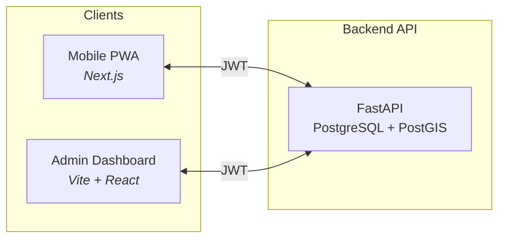

# Hausheld

> Home-help workflow platform for NRW — scheduling, GPS-verified check-in/out, digital signatures, and Entlastungsbetrag tracking. Built with data integrity and EU/GDPR in mind.

---

## Table of contents

- [Features](#features)
- [Architecture](#architecture)
- [Tech stack](#tech-stack)
- [Geospatial & substitution](#geospatial--substitution)
- [Premium dashboard & map](#premium-dashboard--map)
- [GDPR & compliance](#gdpr--compliance)
- [Shift workflow](#shift-workflow)
- [Quick start](#quick-start)
- [Demo mode](#demo-mode)
- [API reference](#api-reference)
- [Operations runbook](#operations-runbook)
- [Recent updates](#recent-updates)

---

## Features

| Area | Description |
|------|-------------|
| **Mobile PWA** | Workers see their schedule, check in/out with GPS, capture client signatures (Leistungsnachweis). |
| **Admin dashboard** | Calendar, workers, clients, map (heatmap + worker pins), billing, audit log — all via sidebar; dashboard shows KPIs and premium analytics (Recharts). |
| **Geo map** | Map page: shift-density heatmap and worker locations (Mapbox + Deck.gl); data from demo seed. |
| **Substitution engine** | Suggests up to 3 replacement workers by distance (PostGIS) and weekly capacity. |
| **Budget & billing** | Per-client monthly budget, 15% alert threshold, CSV export for insurance (SGB XI). |
| **Audit trail** | Append-only log of every access to client (health) data; read-only API. |

---

## Architecture

Hausheld is a distributed ecosystem: one API, two frontends. All mutations go through the backend with JWT and role-based access (Admin vs Worker).



- **Backend** (`/backend`) — Single source of truth. FastAPI, SQLAlchemy 2 (async), PostgreSQL + PostGIS, Alembic. Enforces RBAC, encrypts health data, writes to the audit log.
- **Mobile** (`/frontend`) — Next.js PWA (German UI). Schedule, check-in/out, signature pad, client list for assigned shifts.
- **Admin** (`/admin`) — Vite + React. Dashboard (KPIs + Recharts analytics), calendar (custom week/day/month, Tailwind + shadcn-style), workers & sick leave, clients & budget alerts, **Map** (heatmap + worker pins, Mapbox + Deck.gl), billing export, audit log, substitute assignment. Navigation is via sidebar only (no duplicate cards on dashboard).

Data flow is unidirectional: frontends only call the API; no direct DB access from the client.

---

## Tech stack

| Path | Stack | Role |
|------|--------|------|
| `/backend` | FastAPI, PostgreSQL, PostGIS, SQLAlchemy 2, Alembic, Pydantic | API, auth, geo heatmap, dashboard stats, substitutions, budget, audit, SGB XI export |
| `/frontend` | Next.js, Tailwind, PWA | Mobile worker app |
| `/admin` | Vite, React, Tailwind, custom calendar (week/day/month + time slots), Recharts, Mapbox, Deck.gl | Desktop admin; premium analytics and map |

---

## Geospatial & substitution

PostgreSQL/PostGIS powers **distance-based substitute suggestions** when a shift is unassigned (e.g. worker on sick leave).

- **Worker** and **Client** models store a PostGIS point (WGS84): `current_location` and `address_location`.
- **Endpoint:** `GET /shifts/{id}/suggest-substitutes` (Admin only).
- **Logic:** Ranks candidates by `ST_Distance` (client ↔ worker), excludes overlapping shifts and workers over their weekly `contract_hours`.
- **Result:** Up to 3 workers with distance (m) and remaining capacity; admin assigns with one click.

**Geo API (v1)** — Used by the Admin Map page:

- `GET /api/v1/geo/heatmap` — GeoJSON FeatureCollection of client locations with `weight` = shift count per location (for heatmap layer).
- Workers with `current_location` are shown as pins via existing `GET /workers`. Demo seed gives every client `address_location` and every worker `current_location` so the map shows data after seeding.

---

## Premium dashboard & map

**Dashboard** — The admin dashboard shows:

- **Stat cards:** Workers, clients, unassigned this week, budget alerts (links to relevant pages).
- **Summary from API:** Total active workers, total clients, monthly revenue (€); weekly shift trends (AreaChart); city distribution (DonutChart: Essen, Düsseldorf, Köln); top 5 workers by completed shifts (bar list).
- **Analytics (when shifts exist):** Shifts per week (AreaChart), shift status (DonutChart), budget used % (horizontal bar), completed shifts by worker (bar chart). All use Recharts with gradients and consistent tooltips; no duplicate navigation cards (sidebar only).

**Map page** (`/admin/map`) — Mapbox dark base map + Deck.gl:

- **Heatmap:** Shift density by client location (data from `GET /api/v1/geo/heatmap`).
- **Worker pins:** IconLayer from `GET /workers`; hover shows name and status.
- **Fit bounds** to data; **legend** for heatmap colours. Requires `VITE_MAPBOX_TOKEN` in admin `.env`.

**Logo** — Both apps use `logo_hausheld.png` from `frontend/public` (copied to `admin/public`). Used on login pages, admin sidebar, and mobile header.

---

## GDPR & compliance

| Measure | Implementation |
|--------|-----------------|
| **Health data encryption** | Fernet (AES) for `insurance_number` and `care_level`; key via `ENCRYPTION_KEY` (not in DB). |
| **Audit log** | Append-only `audit_logs`: user, action, target, timestamp. Read-only API — no tampering. |
| **Soft deletes** | Workers, clients, shifts: only `deleted_at` set; rows kept for audit/legal hold. |
| **Data residency** | Designed for AWS eu-central-1 (Frankfurt); health data stays in Germany. |

Full statement: [GDPR_COMPLIANCE.md](./GDPR_COMPLIANCE.md).

---

## Shift workflow

Shifts follow a strict state machine; GPS and signatures provide verifiable proof of service.

| Status | Meaning |
|--------|---------|
| **Scheduled** | Worker assigned; not started. |
| **In_Progress** | Worker has checked in (GPS + timestamp stored). |
| **Completed** | Worker has checked out (GPS + client signature); cost set for budget deduction. |
| **Unassigned** | No worker (e.g. sick leave); admin can use suggest-substitutes and assign. |
| **Cancelled** | Shift not carried out. |

Transitions: `Scheduled` → (check-in) → `In_Progress` → (check-out + signature) → `Completed`. GPS-verified check-in/out replaces paper forms for insurers and audits.

---

## Quick start

**1. Database (PostgreSQL + PostGIS)**

```bash
createdb hausheld
psql -d hausheld -c "CREATE EXTENSION IF NOT EXISTS postgis;"
```

**2. Backend**

```bash
cd backend
python -m venv .venv
# .venv\Scripts\activate  (Windows) or source .venv/bin/activate (Linux/macOS)
pip install -r requirements.txt
cp .env.example .env
# Edit .env: DATABASE_URL, JWT_SECRET, AUTH_DEV_MODE=true
alembic upgrade head
python -m app.utils.seed_demo   # optional: demo data
uvicorn app.main:app --reload
```

→ API: http://127.0.0.1:8000 · Docs: http://127.0.0.1:8000/docs

**3. Mobile frontend**

```bash
cd frontend
npm install
cp .env.example .env.local   # NEXT_PUBLIC_API_URL=http://localhost:8000
npm run dev
```

→ http://localhost:3000 — use Demo Login, then open schedule.

**4. Admin dashboard**

```bash
cd admin
npm install
# .env: VITE_API_URL=http://localhost:8000, VITE_MAPBOX_TOKEN=<your-mapbox-token>  (optional, for Map page)
npm run dev
```

→ http://localhost:5174 — Demo Login as Admin. Use “Load demo data” on the dashboard to seed workers, clients, shifts, and **map data** (all with geo coordinates so the Map page shows heatmap and worker pins).

---

## Demo mode

When the backend has `AUTH_DEV_MODE=true`, both apps offer **Demo Login** (no password):

- **Mobile:** Login page → “Demo: Admin” or “Demo: Worker” → JWT stored, redirect to schedule.
- **Admin:** `/admin/login` → same options → redirect to dashboard.

Ensure demo users exist: run `python -m app.utils.seed_demo` in the backend (or use “Load demo data” in the admin dashboard). The seed creates 13 workers and 25 clients **with geo coordinates** (address_location, current_location) so the **Map page** shows heatmap and worker pins.

---

## API reference

| Area | Endpoints |
|------|-----------|
| Auth | `POST /auth/dev-login`, `GET /auth/me` |
| Geo (v1) | `GET /api/v1/geo/heatmap` (GeoJSON for map heatmap) |
| Stats (v1) | `GET /api/v1/stats/dashboard-summary` (weekly trends, city distribution, budget usage, KPIs, top workers) |
| Shifts | `GET/PATCH /shifts`, `PATCH /shifts/{id}/check-in`, `PATCH /shifts/{id}/check-out`, `GET /shifts/{id}/suggest-substitutes` |
| Workers | `GET /workers`, `POST /workers/{id}/sick-leave` |
| Clients | `GET /clients`, `GET /clients/{id}/budget-status?month=`, `GET /clients/budget-alerts?month=` |
| Billing | `GET /exports/billing?month=` (SGB XI CSV) |
| Audit | `GET /audit-logs` (Admin, read-only) |

---

## Operations runbook

For deployment and day-to-day ops: required env vars, health/readiness checks, where to look for logs, how to run the seed, and basic troubleshooting (e.g. map empty → run seed). See **[docs/RUNBOOK.md](docs/RUNBOOK.md)**.

---

## Recent updates

**February 2026**

- **Logo:** All references use `logo_hausheld.png` (from `frontend/public`; copied to `admin/public`) on login pages, admin sidebar, and mobile header.
- **Dashboard:** Removed duplicate navigation cards (Calendar, Workers, Clients, Billing, Audit) from the dashboard; navigation is via sidebar only. Dashboard now focuses on stat cards, summary KPIs, and premium Recharts analytics (AreaCharts, DonutCharts, bar charts with gradients and consistent tooltips).
- **Stats API:** New `GET /api/v1/stats/dashboard-summary` returns weekly shift trends, city distribution (Essen/Düsseldorf/Köln), budget usage, total workers/clients, monthly revenue, and top 5 workers by completed shifts. Consumed by the dashboard summary section.
- **Map page:** Admin Map uses Mapbox + Deck.gl (heatmap + worker pins); fit bounds and legend. Heatmap data from `GET /api/v1/geo/heatmap`; workers from `GET /workers`. Requires `VITE_MAPBOX_TOKEN` for the base map.
- **Demo seed:** Seed script and final print now explicitly mention map data: every client has `address_location`, every worker has `current_location`, so the Map page shows heatmap and pins after running the seed (or “Load demo data”).
- **Favicon:** Removed `/vite.svg` reference from admin `index.html` to avoid 404.
- **Recharts:** Tooltip formatters updated to accept both number and array (fixes “number is not iterable” in production).

---

## License & disclaimer

This project is for **portfolio and educational** use. Production use requires legal, data-protection, and insurance advice. See [GDPR_COMPLIANCE.md](./GDPR_COMPLIANCE.md).
